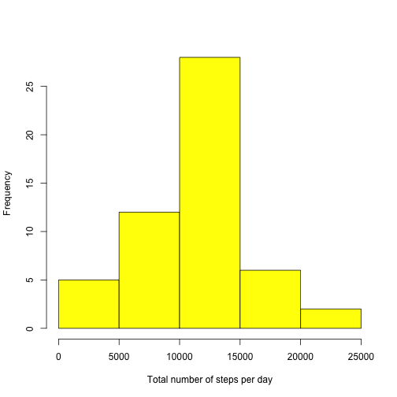
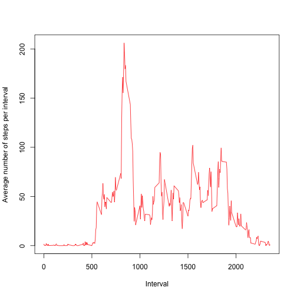
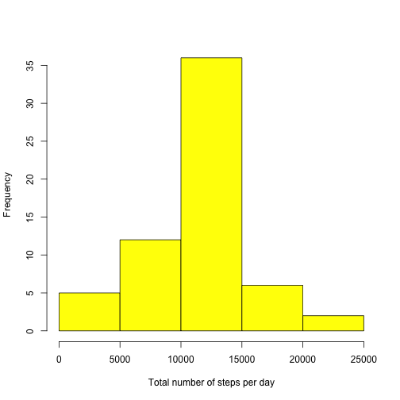
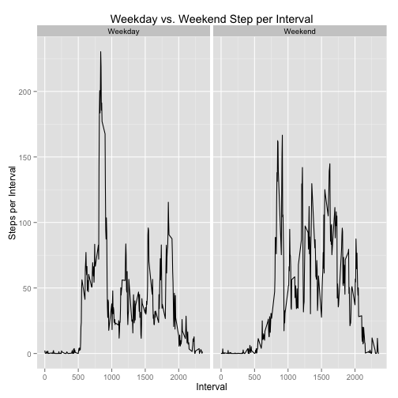

Reproducible Research: Peer Assessment 1
=========================================

##### Introduction
It is now possible to collect a large amount of data about personal movement using activity monitoring devices such as a Fitbit, Nike Fuelband, or Jawbone Up. These type of devices are part of the “quantified self” movement – a group of enthusiasts who take measurements about themselves regularly to improve their health, to find patterns in their behavior, or because they are tech geeks. But these data remain under-utilized both because the raw data are hard to obtain and there is a lack of statistical methods and software for processing and interpreting the data.

This assignment makes use of data from a personal activity monitoring device. This device collects data at 5 minute intervals through out the day. The data consists of two months of data from an anonymous individual collected during the months of October and November, 2012 and include the number of steps taken in 5 minute intervals each day.

##### Data

The data for this assignment can be downloaded from the course web site:

- Dataset: [Activity monitoring data](https://d396qusza40orc.cloudfront.net/repdata%2Fdata%2Factivity.zip) [52K]  

The variables included in this dataset are:

- **steps**: Number of steps taking in a 5-minute interval (missing values are coded as ```NA```)

- **date**: The date on which the measurement was taken in YYYY-MM-DD format

- **interval**: Identifier for the 5-minute interval in which measurement was taken

The dataset is stored in a comma-separated-value (CSV) file and there are a total of 17,568 observations in this dataset.

## **Assignment**

### Loading and preprocessing the data
To begin loading the data we create a tempfile object that will temporarily house the zip file.

```r
temp <- tempfile()
```
We then download the .zip and link it to temp.

```r
download.file('https://d396qusza40orc.cloudfront.net/repdata%2Fdata%2Factivity.zip',temp, method='curl')
```
We can now read in the .csv by unzipping temp.

```r
pa_data <- read.csv(unz(temp,'activity.csv'))
```
We delete the link from temp to the .zip.

```r
unlink(temp)
```
### What is mean total number of steps taken per day?
**1. Make a histogram of the total number of steps taken each day:**  
  
  
To make the histogram we use the aggregate function to sum steps by date and save it in a new object. We then plot total steps by day using this new object.


```r
sum_steps_day <- aggregate(steps ~ date, data = pa_data, sum)
hist(sum_steps_day$steps, main = NULL, xlab = 'Total number of steps per day', col = 'yellow')
```

 

**2. Calculate and report the mean and median total number of steps taken per day:**  

To calculate the mean and median of total number of steps per day we use the same object we aggregated the original data by, above, and simply call the corresponding functions on the steps column.

```r
mean(sum_steps_day$steps)
```

```
## [1] 10766
```

```r
median(sum_steps_day$steps)
```

```
## [1] 10765
```

### What is the average daily activity pattern?
**1. Make a time series plot (i.e. ```type = "l"```) of the 5-minute interval (x-axis) and the average number of steps taken, averaged across all days (y-axis):**  
For this plot we are first going to need to aggregate the mean of steps per interval from the original pa_data object and save it in a new object.Then we plot this new object as ```type = "l"```

```r
avg_steps_int <- aggregate(steps ~ interval, data = pa_data,mean)
plot(avg_steps_int$interval, avg_steps_int$steps, main=NULL, xlab='Interval',ylab='Average number of steps per interval', type='l', col='red')
```

 

**2. Which 5-minute interval, on average across all the days in the dataset, contains the maximum number of steps?:**  
To find the maximum number steps per interval we will simply call the max function on the object created in part 1 to get the index of the maximum value and save it in a new object. We will then use this object to find the value of the largest integer.

```r
max_int <- max(avg_steps_int$steps)
avg_steps_int[avg_steps_int$steps==max_int,1]
```

```
## [1] 835
```

### Imputing missing values
**1. Calculate and report the total number of missing values in the dataset (i.e. the total number of rows with ```NA```s):**  
To calculate the total number of rows with ```NA```s we will find out which values of pa_data (the original dataset) are truly ```NA```s by combining the is.na function with which to get the indices of the ```NA```s and put them in a vector. We then wrap that up in the length function to find out just how many ```NA```s there were.

```r
length(which(is.na(pa_data)))
```

```
## [1] 2304
```

**2. Devise a strategy for filling in all of the missing values in the dataset. The strategy does not need to be sophisticated. For example, you could use the mean/median for that day, or the mean for that 5-minute interval, etc.:**  
I have decided to use the mean value of the interval as a method to replace missing values in this dataset. First we need to get the row indices in a new object. To obtain the row indices of the missing values we are going to create a new object using some of the code above.

```r
miss_values <- which(is.na(pa_data))
```
Now we can use this object with a for loop, along with a nested if statement, to replace the missing values with the mean value of the interval and fulfill step 3. The if statement will be part of the step 3 code.   

**3. Create a new dataset that is equal to the original dataset but with the missing data filled in.:**  
First thing we need to do now is copy pa_data to a new object.

```r
new_pa_data <- pa_data
```
Now we can create our for loop with the nested if statement. 

```r
for(i in miss_values) {
        if(is.na(new_pa_data[i,1])){
                new_pa_data[i,1] <- avg_steps_int[avg_steps_int$interval==new_pa_data[i,3],2]
        }
}
```

**4. Make a histogram of the total number of steps taken each day and Calculate and report the mean and median total number of steps taken per day. Do these values differ from the estimates from the first part of the assignment? What is the impact of imputing missing data on the estimates of the total daily number of steps?:**   
To make the histogram we resuse the same code from the first histogram we made above and slightly rename the object we create.

```r
sum_steps_day2 <- aggregate(steps ~ date, data = new_pa_data, sum)
hist(sum_steps_day2$steps, main = NULL, xlab = 'Total number of steps per day', col = 'yellow')
```

 

We will also resuse code from the same part of the assignment to calculate the mean and median.  

```r
mean(sum_steps_day2$steps)
```

```
## [1] 10766
```

```r
median(sum_steps_day2$steps)
```

```
## [1] 10766
```
As you can you will see below the mean remains the same now that we have no missing values, while the median has changed.

```r
## With missing values
mean(sum_steps_day$steps);median(sum_steps_day$steps)
```

```
## [1] 10766
```

```
## [1] 10765
```
The impact of adding the missing values was getting 8 more days with values in the dataset. We will show the dates that were missing below and the values they had, before and after fixing the missing values.You may notice the first assignment below is wrapped in a suppressWarnings function. This is because that line does produce a warning since we are splitting on a variable that does not have data in both datasets.  


```r
suppressWarnings(missing_proof <- split(sum_steps_day2$steps,sum_steps_day$date))
missing_proof <- which(missing_proof == 'numeric(0)')
sum_both_models <- merge(sum_steps_day, sum_steps_day2, by=1, all.y = TRUE)
sum_both_models[missing_proof,]
```

```
##          date steps.x steps.y
## 1  2012-10-01      NA   10766
## 8  2012-10-08      NA   10766
## 32 2012-11-01      NA   10766
## 35 2012-11-04      NA   10766
## 40 2012-11-09      NA   10766
## 41 2012-11-10      NA   10766
## 45 2012-11-14      NA   10766
## 61 2012-11-30      NA   10766
```

### Are there differences in activity patterns between weekdays and weekends?
**1. Create a new factor variable in the dataset with two levels – “weekday” and “weekend” indicating whether a given date is a weekday or weekend day.:**  
First we add the new variable to dataset with the missing values added. We then create a for loop that transforms the corresponding day name to the 'Weekday' or 'Weekend' delineation and make it a factor variable.  

```r
new_pa_data$weekdayOweekend <- weekdays(as.Date(new_pa_data$date))
for(i in 1:17568) {
        if(new_pa_data$weekdayOweekend[i] == 'Saturday') {
                new_pa_data$weekdayOweekend[i] <- 'Weekend'
        } else if(new_pa_data$weekdayOweekend[i] == 'Sunday') {
                new_pa_data$weekdayOweekend[i] <- 'Weekend'
        } else {
                new_pa_data$weekdayOweekend[i] <- 'Weekday'
        }
}
new_pa_data$weekdayOweekend <- as.factor(new_pa_data$weekdayOweekend)
```
**2. Make a panel plot containing a time series plot (i.e. type = "l") of the 5-minute interval (x-axis) and the average number of steps taken, averaged across all weekday days or weekend days (y-axis).:**  
We first need to load the ggplot2 package into R. We aggregate the data by interval and weekday or weekend. Then we use ggplot to plot the desired graph .  


```r
library(ggplot2)
mean_steps_day_int <- aggregate(steps ~ weekdayOweekend+interval, data=new_pa_data, mean)
ggplot(mean_steps_day_int, aes(x = interval, y = steps)) + geom_line() + facet_grid(.~weekdayOweekend) + xlab('Interval') + ylab('Steps per Interval') + ggtitle('Weekday vs. Weekend Step per Interval')
```

 
